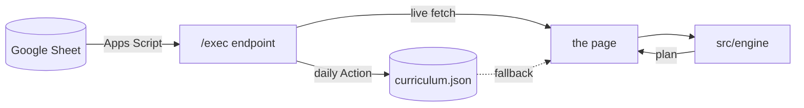
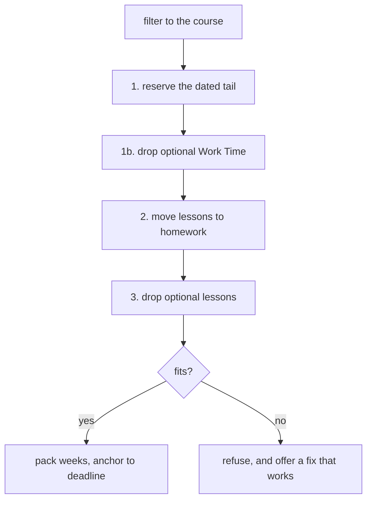

# Curriculum Crosswalk

A planning tool for Technovation facilitators: enter your age group, what the team is
building and how much time you actually have, and get a week-by-week lesson plan
counting down to the 5 May 2027 submission deadline.

Live at **[curriculum-crosswalk.netlify.app](https://curriculum-crosswalk.netlify.app)**

## Why it exists

The Technovation curriculum runs about 50 hours for Senior Mobile. A facilitator with
20 weeks of 90-minute sessions has 30. Something has to give, and deciding *what* —
week by week, without breaking prerequisites or missing the submission deadline — is
the job this tool does.

It answers one question: **given my season, what do I teach, what do I set as
homework, and what do I have to leave out?**

## Quickstart

`file://` will not work — ES modules need a real server.

```bash
git clone https://github.com/RuvaS20/crosswalk && cd crosswalk
python3 -m http.server 8000
# open http://localhost:8000
```

That loads a real plan immediately using the committed `curriculum.json`. No build
step, no dependencies, no `package.json`.

## How it works



The sheet is the source of truth. The page fetches the live endpoint and falls back to
the committed snapshot silently, so a Google outage leaves a working planner.

`src/engine/` is a pure function of `(data, params)` — no DOM, no globals — which is why
every configuration can be swept in a test.

Given a plan that doesn't fit, the engine pulls four levers in order, cheapest first:



Move work before cutting it; cut padding before content. Nothing required is ever
dropped — only lessons marked `optional`, and only after moving work out of class was
not enough. **[Full pipeline and rationale →](docs/architecture.md#the-planning-pipeline)**

## Common tasks

**Run the tests** — 2,537 assertions, standalone, no framework:

```bash
node test/engine.test.mjs
python3 tools/qa-check.py       # data integrity rather than engine behaviour
```

**Refresh the data from the sheet:**

```bash
curl -sL "$(sed -n "s/.*ENDPOINT = '\([^']*\)'.*/\1/p" config.js)" -o /tmp/fresh.json
head -c 200 /tmp/fresh.json     # confirm JSON, not an HTML sign-in page
mv /tmp/fresh.json curriculum.json
node test/engine.test.mjs
```

Never curl straight over the tracked file. A GitHub Action does this daily and refuses
to commit anything that fails the tests.

**See what's feasible** across every age, mode, week count and session length:

```bash
node tools/plan-matrix.mjs
```

**Point it at your own sheet:** edit `config.js` — the one file you must change. It
needs the `/exec` form of the Apps Script URL. A
`script.googleusercontent.com/…echo?…` URL will never work from a browser, and passing
a `curl` test proves nothing, because the failure is CORS.
**[Endpoint setup and the two silent failures →](docs/architecture.md#publishing-and-live-data)**

**Deploy:** connect the repo on Netlify. Build command and publish directory both
empty. Every push to `main` redeploys.

## Layout

```text
index.html              the page — markup only
styles.css
config.js               your Apps Script endpoint — the one file you must edit
curriculum.json         committed snapshot, used when the endpoint is unreachable

src/engine/             the planner — a pure function of (data, params)
  index.js              buildPlan, the constants, the public exports
  filter.js             which lessons are in this plan
  schedule.js           ordering, packing, and fitting a course into a season
src/ui/
  main.js               loads the data, owns the controls, drives the updates
  render.js             everything that writes HTML
  progress.js           per-configuration ticks, and the CSV export

test/engine.test.mjs    2,537 assertions. Standalone — no framework
tools/qa-check.py       data integrity rather than engine behaviour
tools/plan-matrix.mjs   feasibility grid across every configuration
assets/                 the logo
docs/                   architecture.md, decisions.md
apps-script/            Crosswalk.gs, Sync.gs — how the sheet publishes
.github/workflows/      daily curriculum refresh, gated on the test suite
```

Imports are native ES modules with relative paths, so the tree is the dependency
graph: `ui` imports `engine`, and nothing imports `ui`.

## Further reading

- **[Architecture](docs/architecture.md)** — the pipeline, the data model, publishing,
  testing, and every interface behaviour worth knowing
- **[Decisions](docs/decisions.md)** — what changed and why, and what is knowingly
  unfinished

Before editing the sheet, read
**[Data model](docs/architecture.md#data-model)**. Three rules there are only learnable
by breaking them: never sort the sheet, a `choice_group` needs two members naming
*different* builders, and an empty `url` is the sole marker of a Work Time row.
