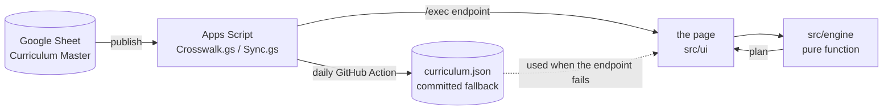
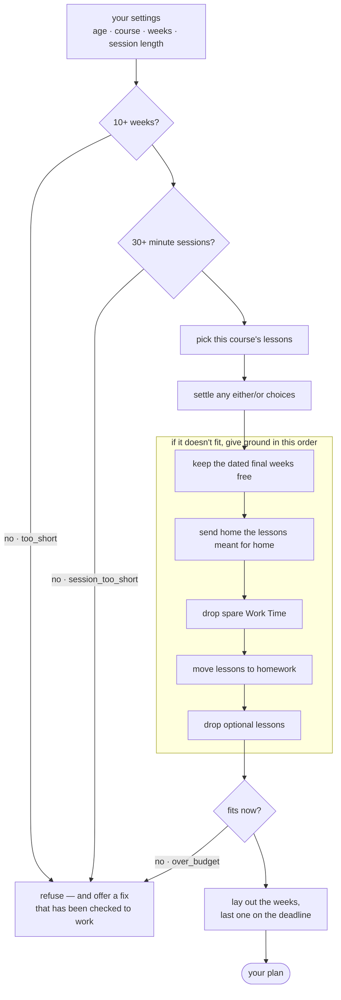
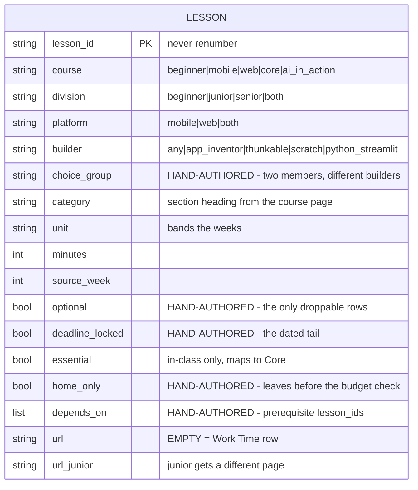

# Architecture

How the spreadsheet becomes a week-by-week plan, and why each stage exists.

- [The system](#the-system)
- [The planning pipeline](#the-planning-pipeline)
- [Notes on behaviour](#notes-on-behaviour)
- [Data model](#data-model)
- [Publishing and live data](#publishing-and-live-data)
- [Testing](#testing)
- [Interface behaviour](#interface-behaviour)
- [Design](#design)

## The system

Four moving parts. Only the middle two are in this repo.



The endpoint is fetched first; `curriculum.json` is the silent fallback. The page does not show which copy it is using. That keeps the planner working during a Google outage, but a broken endpoint can look like a working one. Check `generated_at` in the payload or the browser console to tell the difference.

`src/engine/` takes data and settings and produces the plan. It does not touch the DOM or read globals, so the whole grid can be tested at once.

## The planning pipeline

The order of the levers is the design: move work before cutting it, and cut padding before content.



Reading it: the two gates at the top are the only hard floors. Everything inside the
box is the engine giving ground one step at a time, cheapest first — it stops the
moment the plan fits, so a roomy season never reaches the lower steps. Only the
unlabelled arrows are the happy path.

In code: `filterLessons` → `resolveChoiceGroups` → `fitToBudget` (the box) →
`packWeeks`.

Why this order:

- **Reserve the tail first.** Video and submission work is dated, so it is packed as real lessons, not estimated from minutes. A 75-minute lesson in a 120-minute week still occupies that week.
- **`home_only` is not a lever.** These lessons always leave class before the budget check, and the packer will not bring them back.
- **Drop Work Time before moving content to homework.** Otherwise an optional Work Time slot can stay in class while a real lesson gets pushed home.
- **Work Time is never homework.** It is a room slot with no URL or reading. Sending it home creates an empty task.
- **Refusals carry structured fixes** such as `{label, set:{weeks:10}}`, so the UI can apply and rebuild them. A fix is only shown if the rebuilt plan actually works.

## Notes on behaviour

- **Minimums are 10 weeks and 30-minute sessions.** Both use shared constants (`MIN_WEEKS`, `MIN_SESSION`) so the engine, refusal copy and HTML constraints stay aligned.
- **Work Time never appears under "Not included".** The list filters on `l.url`, so dropped room slots are hidden in *every* course, not only Core. Listing "Work Time" five times tells a facilitator nothing, and the weeks are already visibly gone from the table.
- **Homework is normal.** The Senior Mobile source curriculum is about 50 hours, so a 90-minute weekly session cannot cover it all in class. The plan reports weekly home load and flags loads above two hours.
- **No week carries more than two hours of homework.** Homework attaches to the week of the lesson it follows, which stacks a run of related lessons onto one week — senior web at 14 × 75 once put 9h 15m into a single week while reporting a 1h 17m average. Overflow spills to the next week with room, never backward, so nothing is set before it is taught. Two exceptions stay put: a single lesson longer than the cap, and the final week, which has nowhere to spill to.
- **Required lessons are never dropped.** Only optional lessons can be dropped, and only after moving work out of class is not enough.
- **Tight schedules may refuse more often by design.** Protecting essential lessons removes a major homework lever. A refusal with a workable week count is better than quietly sending required content home.
- **8–12 uses Scratch and App Inventor**, so mobile/web choice is disabled for that age group.
- **Core is a fifth course.** 18 of its 19 rows are essential and the last is Work Time, so nothing in Core can become homework. Senior Core therefore needs 17 weeks at 45/60 minutes, 13 at 90, and 10 at 120.
- **Beginner caps teaching at 1h 45m.** Its lessons are shorter and more numerous, so two-hour sessions could pack unrelated topics together. `BEGINNER_TEACHING_CAP` limits teaching time; remaining time is break/setup. A lesson longer than the cap still gets its own week, and overrun is measured against the real session length.
- **Work Time stays in class or is dropped.** Only optional Work Time can be removed. A non-optional row remains because the sheet is explicitly saying the build session matters.
- **Over-budget refusals can switch to Core in place.** Core is part of this tool, so the button changes the course and redraws. AI Mini is a separate programme and remains a link.

## Data model

The Google Sheet is the source of truth for **structure**; the live site remains authoritative for **lesson content**.



An empty `url` is the only marker for a Work Time row. Work Time is a room slot, not a lesson.

Five fields are hand-authored and exist nowhere on the website: `depends_on`, `optional`, `deadline_locked`, `choice_group`, and `home_only`.

Things worth not relearning:

- **Row order matters.** It controls `choice_group` selection and keeps prerequisites before dependent lessons. Never sort the sheet.
- **Choice groups need different builders.** If both members use `any`, the first always wins and the other becomes unreachable. Junior/Senior differences use `division`.
- **Prerequisites should not cross choice groups** unless both rows use the same builder. Only one choice-group member survives, so the prerequisite may become impossible. `validateOrder` cannot catch this after the losing row is filtered; Rule 8b warns about it.
- **Never renumber `lesson_id`.** Prerequisites and the drift tracker depend on it. Gaps are fine.
- **`category` is the course page's own section heading**, not a shared taxonomy. `filter.js` matches the literal `AI` for the no-AI filter, so category changes must be coordinated with that code.
- **`essential` maps to Core.** If a lesson appears in Core, its equivalent elsewhere is essential. Re-derive this mapping from the Core page when the curriculum changes.
- **`home_only` means better done alone than in a room.** It leaves before budgeting, overrides `essential`, and the packer will not pull it back. Work Time is the exception because it has no content to send home.
- **`home_only` can contradict `homeworkScore`.** That scorer docks `Coding` and `AI` lessons 2 points as "needs the room". Flagging one `home_only` sets the two rules against each other — the sheet wins, but know which you are overruling.
- **New sheet columns need code and redeployment.** Add them to the published field list in `Crosswalk.gs`, then redeploy.
- **The deadline lives in two places:** `src/engine/index.js` and the publish payload in `Crosswalk.gs`. Update both on season rollover.
- **`packWeeks` uses two limits.** `sessionLength` controls whether one lesson overruns; `packTo` controls whether two lessons can share a week. They differ for Beginner, so do not collapse them into one value.

## Publishing and live data

**Read this before changing the publishing setup.**

`config.js` must use the `/exec` Apps Script web-app URL:

```text
https://script.google.com/macros/s/DEPLOYMENT_ID/exec
```

Get it from **Crosswalk → Show published URL**.

Two common silent failures:

- A `script.googleusercontent.com/...echo?user_content_key=...` URL is not the browser endpoint. It is Google's redirect target, lacks the needed CORS header, and can make `curl` succeed while browser `fetch` fails.
- The deployment must be set to **Anyone**. More restrictive settings can return 404s or a sign-in page instead of JSON.

If the endpoint fails, the site silently uses `curriculum.json`. Check the console or `generated_at` to see which copy is active.

A redeploy can change the web-app URL. After every redeploy, check **Show published URL** and update `config.js` if needed.

### Refreshing the fallback copy

A GitHub Action refreshes `curriculum.json` daily at 08:23 UTC and commits only when the payload changes. `generated_at` is stripped before comparison because it is a response timestamp, not a sheet-edit timestamp.

Before publishing, the workflow checks:

1. Valid JSON with at least 100 lessons — fewer refuses to overwrite.
2. A `submission_deadline` in the payload.
3. The full engine test suite, run against the new data.

A broken spreadsheet therefore fails the job instead of shipping. Read the failing log before changing the engine; the problem is often in the sheet.

The workflow needs **Settings → Actions → General → Workflow permissions → Read and write** or the commit step will 403.

To refresh manually:

```bash
curl -sL "YOUR_EXEC_URL" -o /tmp/fresh.json   # never overwrite the tracked file directly
head -c 200 /tmp/fresh.json                   # confirm JSON, not an HTML sign-in page
mv /tmp/fresh.json curriculum.json
node test/engine.test.mjs
```

Refresh the data before running tests, or the suite will check stale data.

## Testing

```bash
node test/engine.test.mjs
```

The engine sweeps every age, platform, AI mode, week count and session length. The 2,537 assertions check that:

- plans fit the available weeks;
- lessons are not packed past `sessionLength`;
- over-long lessons are flagged with `overrun`;
- lessons are not scheduled twice;
- the deadline survives planning;
- refusals explain themselves;
- every displaced lesson lands in exactly one week;
- no lesson is both taught and assigned home;
- `homeworkMinutes` matches the assigned lessons;
- prerequisites are taught before their homework is assigned;
- Work Time is never sent home;
- real content is not dropped while Work Time remains in class.

A separate Core block checks seven tight plans across both age groups. Work Time must land either in class or under "Not included", never under "At home". A guard also checks that the tightest case actually drops something; if it fails, inspect the curriculum instead of deleting the guard.

Additional checks cover the AI in Action Junior/Senior split, including the 8–12 mapping to the junior track.

`tools/qa-check.py` validates the data, including that every Work Time row is optional. Since Work Time is never homework, dropping it is the only way to reclaim its slot.

Assertions are mutation-tested. When adding one, deliberately break the code it protects and confirm the test fails.

## Interface behaviour

- **Controls read as a sentence.** For example, "Preparing for a group of 16–18 year olds. We have 20 weeks of 90 minute sessions." Selects and inputs remain real form controls for keyboard and screen-reader access.
- **Fixed choices are shown, not offered.** For 8–12, "Mobile apps" is stated because the platform is fixed.
- **The sentence stays grammatical.** Core and AI in Action collapse the second clause and replace it with course-specific text.
- **The curriculum selector includes Custom, Core and AI in Action.** AI in Action used to be hidden inside the AI control, even though it is a separate course and ignores mobile/web selection.
- **Results update live.** The engine runs locally in about a millisecond, so selects rebuild immediately. The two number inputs are debounced by 500ms to avoid rebuilding on every keystroke.
- **The endpoint wait is covered.** `#out` contains a static spinner and message before JS loads. `render()` replaces it on the first plan. Reduced-motion users get no frozen spinner.
- **The plan is a card.** It has a deadline header, week table and sticky footer. In-class and at-home work use separate columns so home load is easy to scan.
- **Weeks are grouped by `unit`.** A heading appears when the unit changes. Blank-unit weeks continue the previous band instead of creating fragments.
- **Homework belongs to a week.** A displaced lesson is attached to the week of the nearest preceding in-class lesson, preserving curriculum order.
- **The summary gives the actionable number:** average weekly homework. Above two hours it becomes an indigo warning chip. A no-homework plan says so rather than showing `0m`.
- **Core lessons stay in class.** Core maps to `essential`; the dated tail is protected by `deadline_locked`, so required work remains in the room.
- **Refusals offer actions when possible.** Structured fixes such as `{label, set:{weeks:10}}` let the button change the setting and rebuild.
- **Over-budget refusals do not offer unreliable fixes.** They state the useful week count and offer Core only when Core actually fits. Otherwise they link to AI Mini.
- **Too little time routes elsewhere.** Below 10 weeks or below 30 minutes, the planner points to AI Mini: four one-hour sessions plus a pitch showcase.
- **Core only rescues some plans.** Its main advantage appears at longer sessions; lesson granularity still determines the minimum week count.
- **Over-long weeks say how far over.** The plan shows text such as "30m over your session" instead of making the user calculate it.
- **The summary also counts over-long weeks.** For example, "16 of 20 weeks hold a lesson longer than your 30 minute sessions." This is a warning, not a refusal.
- **A real plan renders on first load.** The page is not blank for first-time visitors.
- **Mobile uses one card per week.** The week number becomes the header, content columns stack, and labels come from `data-label`.
- **Defaults are 20 weeks × 90 minutes.** Number fields look like typed blanks rather than select pills, and their spin controls remain visible.
- **Builder choice appears only when meaningful.** App Inventor vs Thunkable for 13–18 mobile; App Inventor vs Scratch for 8–12. Web, Core and AI in Action do not show it.
- **8–12 on AI in Action gets a caution.** The course has no 8–12 rows, so the engine maps Beginner to the junior track.
- **Junior teams get junior links.** Shared Mobile/Web rows carry `url_junior`; the engine swaps URLs by age. Division-specific rows are left unchanged.
- **Progress is saved by lesson, not week.** `localStorage` uses `crosswalk.done.v2`, keyed by `lesson_id` and scoped to the configuration that determines which lessons appear. Weeks and session length are excluded because they only repack the same lessons.
- **Print produces a compact one-page planner.** It includes the summary, drawn checkboxes and current completion state.
- **Spreadsheet export includes:** `Week, Taught, Lesson, Mins, Topic, Activities, Link, Completed`. Progress carries through. Homework rows use their own activities and fall back to the other side when needed; UTF-8 includes the BOM; activity newlines are preserved inside quoted CSV cells.
- **Lesson links open the public curriculum.** The lesson pages on `technovationchallenge.org` are readable without an account.

## Design

Brand colours come from the Technovation covers:

- Deep indigo `#1D1349` — headings, active states, ink on lime
- Lime `#D8E583` — accent fill only
- Darkened lime `#5A6912` — for lime-coloured text

All three sit on a warm off-white page. Lime is too light for text on white, so it
works as a fill and highlight with indigo on top; the darkened lime clears 4.5:1 on
both white and the lime tint. Headings use Rubik, body text uses Poppins.
